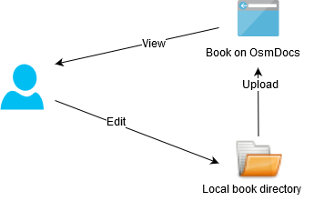

# Preparing Your Computer

In order to write [books](creating-and-editing-books.html) (directories containing Markdown files and images and being shown as websites) efficiently you will need:

* a decent Markdown editor - you will spend most of the time writing Markdown files;
* SFTP client to connect to the OsmDocs server and edit the book files directly or a SFTP sync to synchronize local book files with book files on OsmDocs server;
* (optionally) some visual tool for working with Git version control - or to be comfortable with command line - in case you want to organize team work around the book and have  version history of all the changes.

If you already have the software for that - do use it and skip to the next section.  

Personally, I use [OsmSync](preparing-your-computer/osmsync.html) for syncing files and [IntelliJ IDEA Community Edition](preparing-your-computer/intellij-idea.html) for editing Markdown files locally and for Git integration. 

It works as follows: I edit files locally, OsmSync uploads the changes to the OsmDocs server, I check how it looks in a browser, then I do more editing, ...:

 

I have also configured IntelliJ IDEA to open [MarkdownPad](http://www.markdownpad.com/) for editing Markdown files, but that's really optional - IntelliJ IDEA has nice built-in Markdown editor.

Some alternatives:

* If you already have [PhpStorm or almost any other IDE by JetBrains](preparing-your-computer/phpstorm-or-other-jetbrains-ide.html) - use it as a replacement both for IntelliJ IDEA and OsmSync.
* If you don't plan to use Git, consider using [Atom](preparing-your-computer/atom.html) for book file editing locally in combination with [OsmSync](preparing-your-computer/osmsync.html) for syncing files to the OsmDocs server. 
* If you prefer to edit files directly on the OsmDocs server instead - consider using [FileZilla](preparing-your-computer/filezilla.html) or other SFTP client:

    

There are many more alternatives out there, just search for "SFTP client", "Markdown editor", "Git UI". If all the listed solutions are not for you for some reason - pick your own toolset.  

This section dives into details of setting up and using all these tools:

{{ child_pages }}