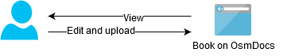

# Using SFTP

Conceptually, there are three kind of tools for working with book files via SFTP:

1. If you are not afraid of the command line, use [OsmSync](using-sftp/osmsync.html).

    With OsmSync, first download files of all of your books from OsmDocs server using `gulp pull` command and then watch them for changes and upload changes to OsmDocs server on the fly with `gulp watch` command. You can even setup it as a service and forget - it will still track all the changes and upload them to OsmDocs server in background.

    This way, you will always have full copy of all of your books locally. Use your favorite Markdown or IDE for editing those files.

    

2. Use SFTP client such as [FileZilla](using-sftp/filezilla.html), WinScp, Cyberduck or other for browsing, creating, editing and deleting files on the server.

    It is the most straightforward way of working with SFTP server.

    Use SFTP client if you don't write a lot and don't want to bother with installing and configuring [OsmSync](using-sftp/osmsync.html).

    Configure SFTP client to open `.md` files in your favorite external Markdown editor.

    

3. Most IDEs (integrated development environments) such as [PhpStorm](using-sftp/phpstorm.html) (and almost any other IDE from [JetBrains](https://www.jetbrains.com/products.html)), [Atom](using-sftp/atom.html), VS Code allow to download project files from a server, edit it locally and upload them back to the server. If you use an IDE, consider using it for editing book files.

    This way, you can use single tool both for coding and for writing.

    IDEs support automatic file syncing to a various degree, but some are very decent at that, for instance [PhpStorm](using-sftp/phpstorm.html).

    Explore ecosystem around your IDE for the best possible internal Markdown editor. [Atom](markdown-editors/atom.html) especially shines at that. Alternatively, configure your IDE to open `.md` files in your favorite external Markdown editor.

Internally, I use [OsmSync](using-sftp/osmsync.html) for syncing files via SFTP and [Atom](markdown-editors/atom.html) for local file editing. However, you may have different setup according to your needs and preferences.

After picking one of the listed tools, follow the link to open tool-specific usage instructions.
