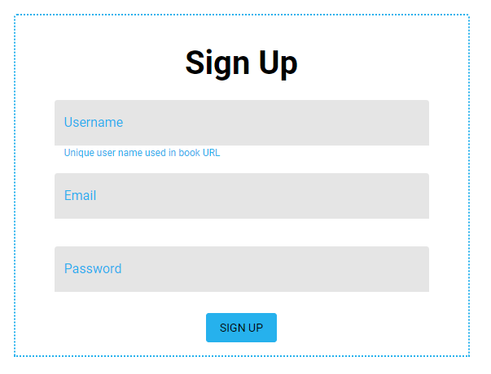

# Signing Up

1. Open <https://osmdocs.com/> and press `Sign Up` menu item. Sign up page opens:

2. Enter a user name which represents you the best. You can change it later, but keep in mind that user name is part of every book page URL, so changing it later will also change URL of every book page.
3. Enter your email address. We may use this email address later to let you know about important stuff.
4. Enter secure password. Consider using a password generator such as <https://passwordsgenerator.net/> or a [passphrase](https://en.wikipedia.org/wiki/Passphrase). Keep the password in safe place.
5. Finally, press `Sign Up` button.

You can change your account settings later or delete your account in `My Account` menu.
