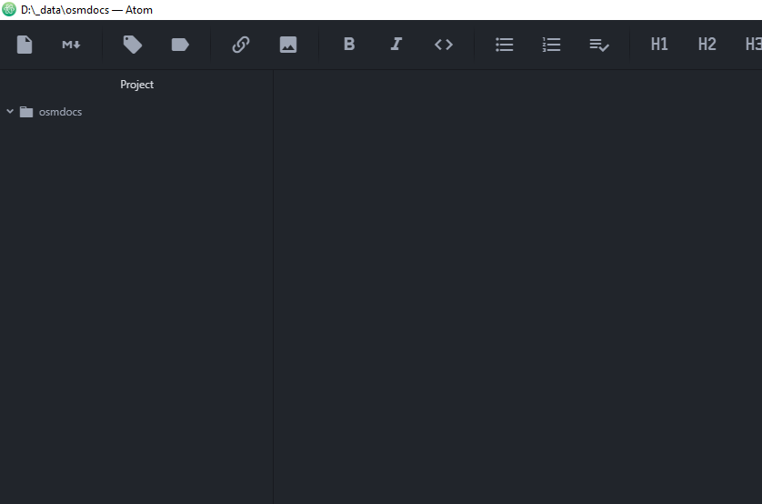
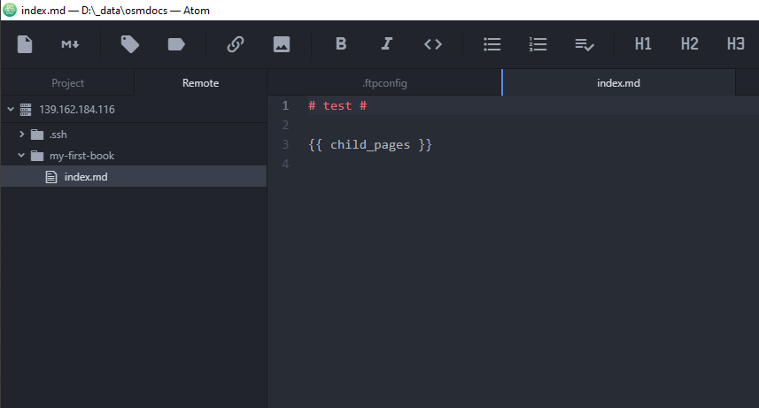

# Atom (SFTP)

{{ toc }}

## Installing `remote-ftp` Atom Package

1. Open [Atom](https://atom.io/) (install Atom if it is not insalled yet) and open its settings via menu `File -> Settings` or by using `Ctrl + Comma` shortcut and click on `Install` tab:

    

2. Enter `remote-ftp` package name into `Search packages` text box and press `Enter`. In search result list, locate `remote-ftp` package created by `icetee` and click its `Install` button.

This package will allow you to edit book files via SFTP. It will upload your changes whenever you edit book files in Atom and save the files (`Ctrl + S` keyboard shortcut). This package will also track any changes in book directory and upload them as necessary, so you can edit and save files using any external Markdown editor of your choice.

## Connecting To OsmDocs

Atom project is a directory on your local hard drive containing configuration files specifying SFTP connection settings and local copy of all the files of all your books.

Atom project is needed for the book editing, so let's create it:

1. Click on Atom's `File -> Open Folder` menu item or press `Ctrl + Shift + O`, pick or create (by right-clicking inside exiting directory and picking `New -> Folder` menu item from context menu) a directory on your local hard drive and click `Select Folder` button to open selected directory as Atom project:

    

    It's empty, but not for a long time :)

2. Right-click on root directory name in project sidebar and pick `New file` menu item from context menu. When prompted for a filename, enter `.ftpconfig`. In file editor, paste the following settings:

        {
            "protocol": "sftp",
            "host": "{host}",
            "port": 22,
            "user": "{user}",
            "pass": "{pass}",
            "remote": "/",
            "watch":["**/*.*"],
            "watchTimeout":500
        }

    Replace `{host}`, `{user}` and `{pass}` placeholders with actual SFTP connection options from `My Books -> [gear icon] -> Edit book contents using SFTP` section in your OsmDocs account.

3. Right-click on root directory name in project sidebar one more time and pick `New file` menu item from context menu. When prompted for a filename, enter `.ftpignore`. In file editor, paste the following settings:

        /.ftpignore
        /.ftpconfig
        /.ssh/
        /temp/
        .git/

4. Show `Remote` tab in the left sidebar in the left pane by using `Packages ->Remote FTP -> Toggle` menu. Drag `Remote` tab and make it a separate sub-pane in the left pane.

4. Connect to SFTP using `Connect` button in the `Remote` tab in the left sidebar:

    

## Working With Files

Use right-click context menu actions in the left sidebar to create, open and delete files, to sync server directory to local directory or to vice versa.

After making changes and saving them using `Ctrl + S` keyboard shortcut, open the book in the browser by clicking on a book link in `My Books` page of your OsmDocs account and see how the changes look like.

Atom provides convenient SFTP features. Whenever you open remote file it is downloaded and is shown in `Project` tab. Whenever you edit file in `Project` tab it is saved on the server.

Still, local and remote files may go out of sync with file rename operations and dragging files between directories. If you notice that `Project` and `Remote` tab are out of sync, disconnect by using `Alt + Ctrl + D` keyboard shortcut and connect again by clicking on `Connect` button in the `Remote` tab and then find and resolve the differences.

## Auto-Saving Files In Atom

After editing a file in Atom you normally have to press `Ctrl + S` to save changes to disk and to upload them to the server. It may lead to certain confusion, so let's enable auto-saving files whenever you switch from Atom to the browser:

1. Open Atom settings via menu `File -> Settings` or by using `Ctrl + Comma` shortcut, click on `Packages` tab and enter `autosave` into `Filter packages` text box:

    

2. Click `Settings` button of the `autosave` package, and then check `Enabled` checkbox in the `Settings` section:

